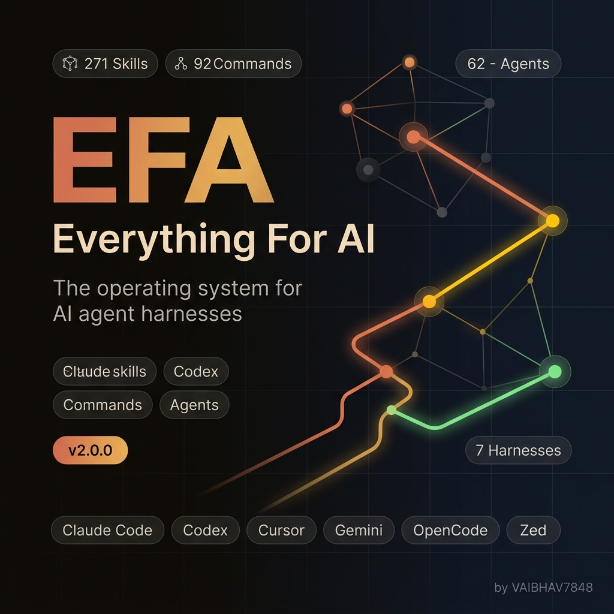
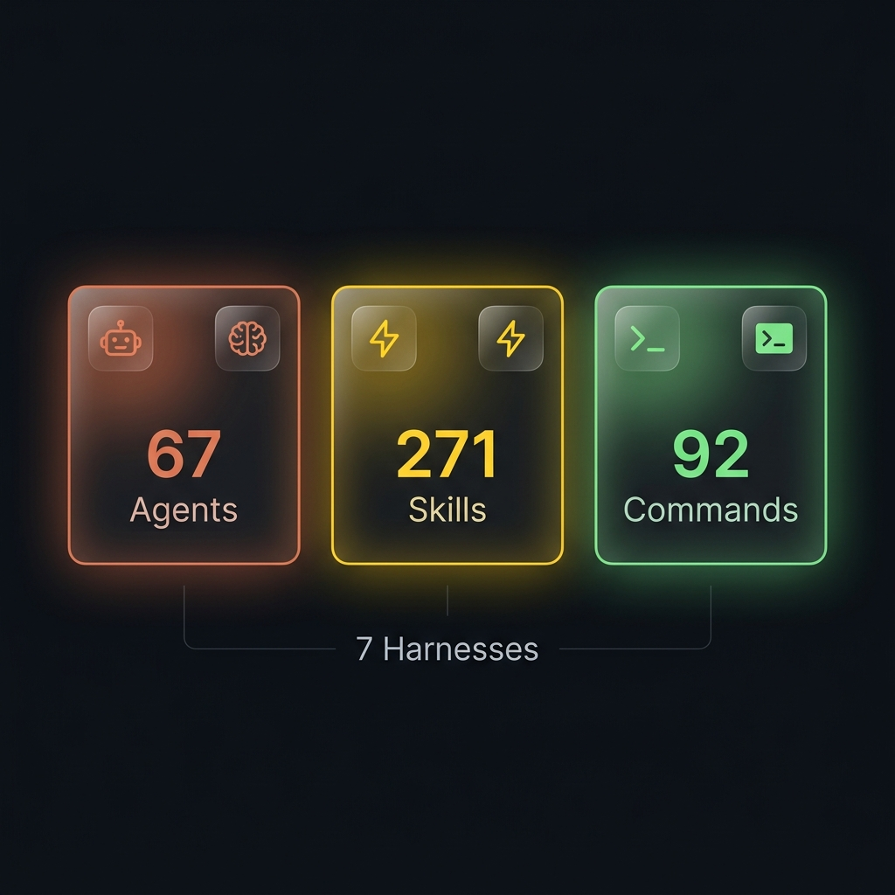
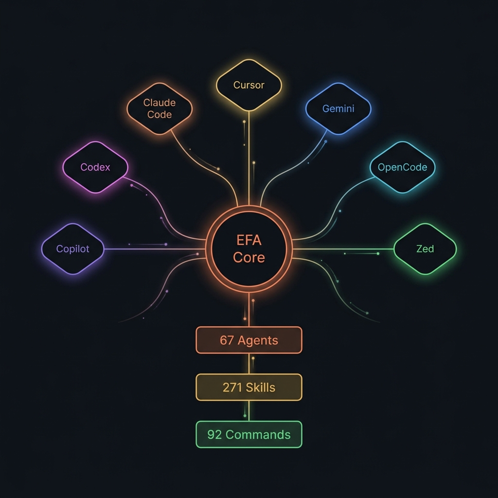

<div align="center">

<!-- HERO BANNER -->


<br />

<!-- ANIMATED TYPING -->
<a href="https://github.com/VAIBHAV7848/EFA">
  
</a>

<br />

<!-- MAIN BADGES -->
[](https://github.com/VAIBHAV7848/EFA/stargazers)
[](https://github.com/VAIBHAV7848/EFA/network/members)
[](LICENSE)
[](CHANGELOG.md)
[](tests/)

<br />

<!-- LANGUAGE BADGES -->


<br /><br />

<!-- FEATURES BANNER -->


<br /><br />

**Not just configs. A complete operating system for AI-powered development.**

Production-ready agents, skills, hooks, rules, MCP configs, and automated workflows —<br />
evolved over **10+ months** of real-world daily engineering across **12+ language ecosystems**.

<br />

<!-- PLATFORM SUPPORT BADGES -->


</div>

<br />

---

<br />

## ⚡ Quick Start

<table>
<tr>
<td width="50%">

### 📦 Install as Plugin

```bash
# Claude Code (recommended)
claude plugin add --from github.com/VAIBHAV7848/EFA

# Or via npm (GitHub Packages)
npm config set @VAIBHAV7848:registry https://npm.pkg.github.com
npm install -g @VAIBHAV7848/efa-universal
```

</td>
<td width="50%">

### 🔧 Manual Install

```bash
git clone https://github.com/VAIBHAV7848/EFA.git
cd EFA && npm install
```

</td>
</tr>
</table>

### 🎯 Start Building Immediately

```bash
/plan "Add user authentication"       # 📋 Plan any feature with AI agents
/code-review                          # 🔍 Instant code quality + security review
/build-fix                            # 🔧 Auto-fix build & type errors
/security-scan                        # 🛡️ Full security audit (AgentShield)
/test-coverage                        # 📊 Analyze & improve test coverage
/go-test                              # 🧪 TDD workflow (Go/React/Rust/Kotlin/etc.)
/multi-workflow                       # 🔀 Multi-model orchestration
/pr "feat: add auth system"           # 🚀 Create GitHub PR with AI summary
```

<br />

---

## ⚡ God Mode: The Ultimate Power Upgrade

EFA is no longer just static rules—it is an active, parallel-executing AI engine. We have integrated three exclusive features that make EFA the most powerful AI Operating System in existence:

1. **🧠 Infinite Context (Vector Memory Engine)**
   EFA doesn't forget. Key decisions, architectures, and rules are stored in a local semantic JSON vector store. EFA will silently recall these tags across sessions without destroying your context window limits. 
   - *Try it:* `node scripts/efa-memory-engine.js store "system, architecture" "Rule: glassmorphism"`

2. **🌪️ True Parallelism (The Swarm Orchestrator)**
   Stop waiting for agents to run sequentially. EFA uses Node.js asynchronous processes to spawn multiple AI sub-agents at the exact same time. Launch a frontend dev, backend dev, and security reviewer simultaneously.
   - *Try it:* `/swarm "echo 'Agent 1'" "echo 'Agent 2'"`

3. **🛠️ Auto-Healing Execution Loops (God Mode)**
   Prefix any failing command with `/auto-heal`. Instead of crashing, EFA intercepts the stack trace, feeds it back to itself in a JSON payload, fixes the code autonomously, and re-runs the process until it's green.
   - *Try it:* `/auto-heal npm run test`

## 👑 Tier-3 God Mode (Absolute Pinnacle of AI Power)

EFA includes experimental Tier-3 capabilities that push it beyond any existing framework:

1. 👁️ **EFA Sentinel (Real-Time Watcher):** A background daemon that watches your codebase. The millisecond you hit `CTRL+S`, Sentinel analyzes your code and automatically fixes syntax errors before you even switch to your terminal. (`/sentinel`)
2. 🐳 **EFA Docker Sandbox:** Execute chaotic, destructive, or complex agent tests safely within ephemeral isolated containers, protecting your host OS. (`node scripts/efa-docker-sandbox.js`)
3. 🧬 **AST Parsing Engine:** EFA stops reading your code as text and starts reading it as Abstract Syntax Trees (AST). It understands the exact mathematical logic of your application, destroying hallucination. (`node scripts/efa-ast-parser.js`)
4. 🧠 **The Evolution Engine (Self-Modifying Core):** EFA tracks its own successes and failures. When it learns a new coding pattern or fixes a bug, it permanently rewrites its own `SKILL.md` brain files. EFA literally programs itself to get smarter over time. (`/evolve`)

<br />

---

<br />

## 🏗️ Architecture

<div align="center">

</div>

<br />

---

<br />

## 🧠 What's Inside

<br />

<table>
<tr>
<td width="50%" valign="top">

### 🤖 67 Specialized Agents

AI subagents that handle delegated tasks with surgical precision:

| Category | Agents |
|:---------|:-------|
| **🏗️ Architecture** | `planner`, `architect` |
| **✅ Quality** | `code-reviewer`, `security-reviewer`, `tdd-guide` |
| **🔧 Build** | `build-error-resolver`, `cpp-build-resolver`, `go-build-resolver`, `java-build-resolver`, `kotlin-build-resolver`, `rust-build-resolver` |
| **🔍 Review** | `typescript-reviewer`, `python-reviewer`, `go-reviewer`, `rust-reviewer`, `kotlin-reviewer`, `java-reviewer`, `cpp-reviewer`, `django-reviewer` |
| **🧪 Testing** | `e2e-runner`, `tdd-guide` |
| **🤖 AI/ML** | `mle-reviewer`, `pytorch-build-resolver` |
| **⚙️ Ops** | `loop-operator`, `harness-optimizer`, `doc-updater` |
| **🗄️ Data** | `database-reviewer` |

<br />

> 📂 See all 67 agents in [`agents/`](agents/)

</td>
<td width="50%" valign="top">

### ⚡ 271 Deep Skills

Production-tested workflow knowledge:

| Domain | Coverage |
|:-------|:---------|
| **🌐 Languages** | TypeScript, Python, Go, Rust, Kotlin, Java, C++, Swift, Perl, PHP, F#, Dart |
| **⚛️ Frameworks** | React, Next.js, Django, Laravel, Spring Boot, NestJS, Vue, Nuxt, Flutter, Ktor, Quarkus |
| **🗄️ Databases** | PostgreSQL, MySQL, Redis, ClickHouse, Firebase, MongoDB |
| **🐳 Infra** | Docker, Kubernetes, CI/CD, PM2, deployment patterns |
| **🧠 AI/ML** | PyTorch, ML pipelines, LLM cost routing, eval harness |
| **🛡️ Security** | Vulnerability scanning, OWASP, supply-chain audit |
| **🧪 Testing** | TDD, E2E, property-based, coverage gates |
| **📝 Docs** | Codemaps, API docs, changelog automation |

<br />

> 📂 See all 271 skills in [`skills/`](skills/)

</td>
</tr>
</table>

<br />

<table>
<tr>
<td width="50%" valign="top">

### 💻 92 Slash Commands

Instant workflows from your terminal:

| Command | What It Does |
|:--------|:-------------|
| `/plan` | AI-powered implementation planning |
| `/code-review` | Quality + security review |
| `/build-fix` | Auto-fix build errors |
| `/security-scan` | Full security audit |
| `/test-coverage` | Coverage analysis & gap filling |
| `/refactor-clean` | Dead code removal |
| `/pr` | Create GitHub PR with AI summary |
| `/multi-workflow` | Multi-model orchestration |

**Language-specific:**
`/go-review` · `/python-review` · `/react-review` · `/rust-review` · `/kotlin-review` · `/cpp-review`

**TDD workflows:**
`/go-test` · `/react-test` · `/rust-test` · `/kotlin-test` · `/cpp-test`

</td>
<td width="50%" valign="top">

### 🔗 Hooks, Rules & MCP

**🪝 Hooks** — Trigger-based automations
- Session memory persistence
- Strategic compaction at breakpoints
- Pattern extraction & continuous learning
- GateGuard destructive command gating

**📏 Rules** — Always-follow coding guidelines
```
rules/
├── common/       # Universal (immutability, TDD, security)
├── typescript/   # TS/JS patterns
├── python/       # Python patterns
├── golang/       # Go patterns
├── swift/        # Swift patterns
├── php/          # PHP patterns
└── arkts/        # HarmonyOS patterns
```

**🔌 MCP Configs** — Pre-configured servers
- GitHub, Supabase, Vercel, Railway, and more

</td>
</tr>
</table>

<br />

---

<br />

## 📁 Project Structure

```
EFA/
│
├── 🤖 agents/              # 67 specialized subagents
├── ⚡ skills/              # 271 workflow skills & domain knowledge
├── 💻 commands/            # 92 slash commands
├── 🪝 hooks/               # Trigger-based automations
├── 📏 rules/               # Coding guidelines (common + per-language)
├── 🔧 scripts/             # Cross-platform Node.js utilities
├── 🧪 tests/               # 2,836 tests passing
├── 🔌 mcp-configs/         # MCP server configurations
├── 📚 docs/                # Guides & documentation
├── 🦀 efa2/                # EFA 2.0 Rust core (alpha)
├── 📦 plugins/             # Multi-harness plugin manifests
├── 🎯 contexts/            # Dynamic system prompt contexts
├── 📋 examples/            # Example configurations
└── 🎨 assets/              # Images & visual assets
```

<br />

---

<br />

## 🌐 Cross-Platform Support

<div align="center">

| Platform | Status | Method | Features |
|:---------|:------:|:-------|:---------|
| **Claude Code** | ✅ Full | Plugin / Manual | Agents, Skills, Commands, Hooks, Rules, MCP |
| **Codex** | ✅ Full | Plugin | Agents, Skills, Commands |
| **Cursor** | ✅ Full | Rules + Skills | Rules, Skills, Contexts |
| **Gemini** | ✅ Full | Plugin | Agents, Skills, Commands |
| **OpenCode** | ✅ Full | Plugin | Skills, Commands, Hooks |
| **Zed** | ✅ Full | Extension | Agents, Skills |
| **GitHub Copilot** | ✅ Full | Instructions | Agents, Skills |

</div>

<br />

---

<br />

## 🧪 Testing

```bash
npm test                    # Full suite → 2,836 tests passing ✅
npm run test:hooks          # Hook tests only
npm run test:scripts        # Script tests only
```

<br />

---

<br />

## 🤝 Contributing

See [CONTRIBUTING.md](CONTRIBUTING.md) for guidelines. We use conventional commits:

```
feat: new feature          fix: bug fix            docs: documentation
test: add tests            refactor: restructure   chore: maintenance
perf: performance          ci: CI/CD changes
```

<br />

---

<br />

## 🛡️ Security

Built-in security at every layer:

| Guard | Purpose |
|:------|:--------|
| **GateGuard** | Gates destructive shell commands (`rm`, force `git`, etc.) |
| **AgentShield** | Audits agent, hook, MCP, permission & secret surfaces |
| **Supply-chain scanner** | IOC detection in CI |
| **Security reviewer** | Automated vulnerability detection agent |

Report vulnerabilities via [SECURITY.md](SECURITY.md).

<br />

---

<br />

<div align="center">

## 📄 License

**MIT** — Use freely, modify as needed, contribute back if you can.

<br />

---

<br />

**Built with ❤️ by [VAIBHAV7848](https://github.com/VAIBHAV7848)**

<br />

<a href="https://github.com/VAIBHAV7848/EFA">
  
</a>

<br /><br />


</div>
